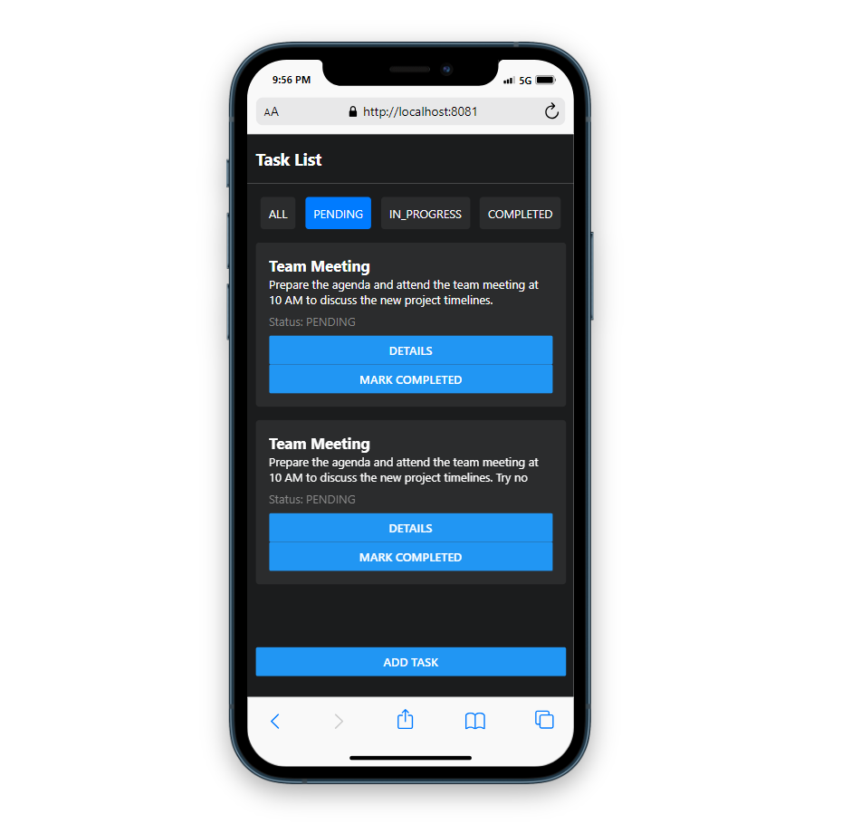
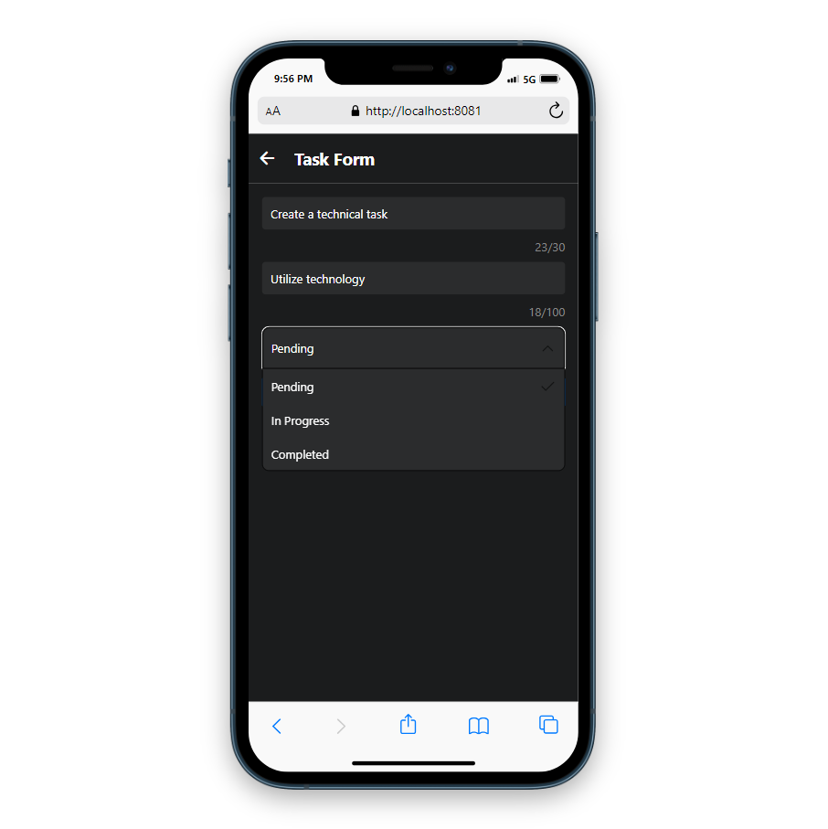
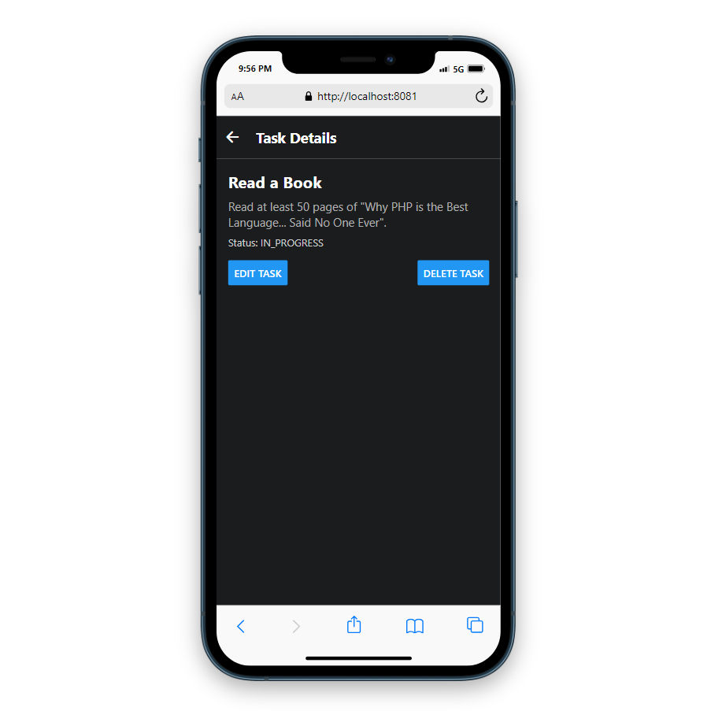

# Task Manager Mobile App

This is a mobile application for managing tasks (to-do list) built with React Native using Expo. It includes functionalities for adding, viewing, editing, and deleting tasks. The app uses a simple and clean UI inspired by the Steam mobile app design.

## Screenshots





## Features

- **User Interface for Task Management:** A user-friendly interface that allows interaction with tasks.
- **Task List Screen:** Displays tasks in a list format with options to view details and edit tasks.
- **Server-Side Data:** Task data is fetched from the server.
- **Complete Task:** Added functionality to mark a task as completed directly from the task list.
- **Pleasant Interface:** Designed with a visually pleasing user interface.
- **Sort Buttons:** Added buttons to sort tasks.
- **Loader:** Implemented a loader for better user experience.
- **Form Validation:** Added validation to the task form (title and subtitle must have at least 1 character and there are constraints on the number of characters).

## Technologies

- **React Native**
- **Expo**
- **React Navigation**
- **TypeScript**

## Getting Started

Follow these instructions to get a copy of the project up and running on your local machine for development and testing purposes.

### Prerequisites

- Node.js and npm installed
- Expo CLI installed
- Android Studio and/or Xcode for emulators

### Installation

1. Clone the repository:

   ```bash
   git clone https://github.com/yourusername/task-manager-mobile.git
   cd task-manager-mobile
   ```

2. Install the dependencies:

   ```bash
   npm install
   ```

3. Start the development server:

   ```bash
   npx expo start
   ```

4. Open the app on your device:
   - For Android: Press `a` to open on an Android emulator.
   - For iOS: Press `i` to open on an iOS simulator.
   - For Web: Press `w` to open in the browser.

## Project Structure

- `index.js`: The entry point of the application.
- `app.json`: Configuration file for the Expo project.
- `screens/`: Directory containing the screen components.
  - `TaskList.tsx`: Screen to display the list of tasks.
  - `TaskForm.tsx`: Screen to add or edit a task.
  - `TaskDetails.tsx`: Screen to view details of a specific task.
  - `NotFoundScreen.tsx`: Screen to display when a route is not found.

## API Client

The `apiClient.ts` file is responsible for interacting with the backend server to perform CRUD (Create, Read, Update, Delete) operations on tasks. It uses `axios` to make HTTP requests and handle responses.

### Overview

The `apiClient.ts` file provides the following functions:

- `createTask`: Creates a new task.
- `getTasks`: Retrieves a list of tasks.
- `getTaskById`: Retrieves a task by its ID.
- `updateTask`: Updates an existing task.
- `deleteTask`: Deletes a task by its ID.

## Available Scripts

- `npm start`: Start the Expo development server.
- `npm run android`: Run the app on an Android emulator.
- `npm run ios`: Run the app on an iOS simulator.
- `npm run web`: Run the app in the browser.
